# Final-Year-Project-Applied-Diss
4th year Software Development Final Year Project

## Contents
* [Project Details](#details)
* [Introduction](#intro)
* [Video Demo](#demo)
* [Dissertation](#dissertation)
* [Architecture](#arc) 
* [Features](#features)
* [App Preview](#preview)
* [Deployment](#deploy)

# Project Details<a name = "details"></a>

| Project Details   |     |
| --- | --- |
| **Course** | BSc (Hons) in Software Development  |
| **Module** |  Applied Project and Minor Dissertation |
| **College** | [GMIT](http://www.gmit.ie/) Galway |
| **Students** | [Derrick Conway](https://www.linkedin.com/in/derrick-conway-12b81113a/) G00328406 <br/> [Gary Mannion](https://www.linkedin.com/in/gary-mannion-56236713a/) G00319609|
| **Project Supervisor** | Patrick Mannion |
| **Module Supervisor** | John Healy |
| **Project Title** | Farm At Ease |


[Top](#contents) 

# Introduction<a name = "intro"></a>
For our final year project, we decided to create a Farming App called Farm At Ease, specifically for young farmers. Currently there is a farming crisis across Ireland and we felt an App like ours was badly needed.  Working as a team and following an agile methodology we developed an App that allows users to view to keep track of animals dosing, AI, calf Tagging and be able to measure how much feed you have for the stock for the winter months ahead.  Adding these specific features will help young farmer in everyday life to reduce stress and depression that young farmer face in every day.  We created a 3-tier application, using Mongo Db and CouchDB as the our Data Tier, NodeJS for our Logic Tier and Ionic 3 for our Presentation Tier which we used FireBase Authentication for our login/register section.  


[Top](#contents) 

# Video Demo<a name = "demo"></a>

This is a link to brief 2 min video of the application.
https://www.youtube.com/watch?v=0lMA6Trt_xg

This is a link to the demo of our application.
https://www.youtube.com/watch?v=v1VYPLz4iYU

[Top](#contents) 

# Dissertation<a name = "dissertation"></a>
Click below to view our Dissertation PDF or click [here](https://github.com/Gazza1996/Final-Year-Project-Applied-Diss/tree/master/Dissertation) to view the latex files used to create it. 

<kbd>[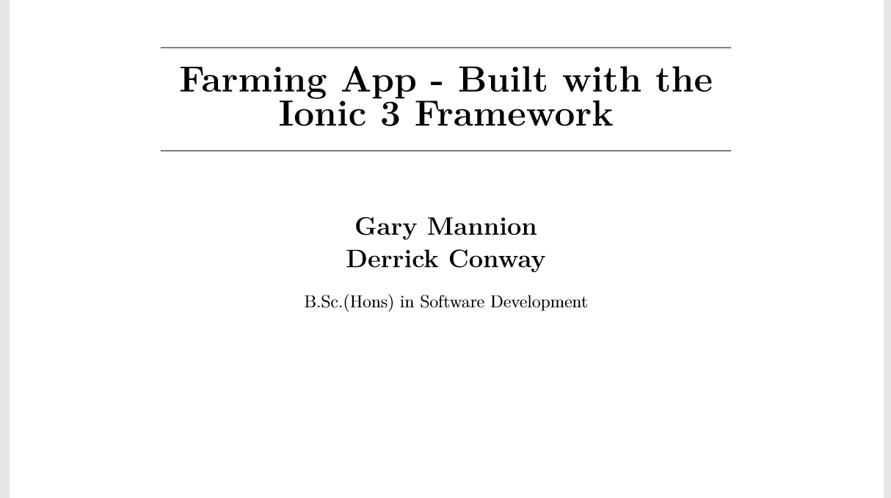</img>](https://github.com/Gazza1996/Final-Year-Project-Applied-Diss/blob/master/Dissertation.pdf)</kbd>

[Top](#contents) 

# Architecture<a name = "arc"></a>
The following is an overview of the Technologies/Architecture used creating Farm At Ease.

<p align="center"><kbd></p></kbd>

### Presentation Tier

* [Ionic 3 Framework](https://ionicframework.com/docs/)
* [Angular 4 Framework](https://angular.io/)
* [Firebase Authentication](https://firebase.google.com/)

### Logic Tier
* [NodeJS](https://nodejs.org/en/)

### Data Tier
* [MongoDB](https://www.mongodb.com/company) Database 
* [CouchDB](http://couchdb.apache.org/) Database

[Top](#contents) 

# Features<a name = "features"></a>
The following are the main features of our project:
* Users can create their own Account
* Users can Log into their Account
* Users can reset their password if they have forgotten theirs
* Users has option for six areas AI, Medicines, Tagging, Feed, Scanner, Reports.
* Users can update and delete but only in certain parts of a section.
* Users can search medicines and tags.
* Logged in users can enter and delete new heard tags.
* Logged in users can calaulate the amount silage feed needed for the winter and spring mounts.
* Logged in users can record animals in calf in AI section.
* Logged in users can scan medicine bottles for information on withdraw period for meat and milk.
* Logged in users can record heard animales reciving medicine.
* Logged in users can record heard reports in the reports section.

[Top](#contents) 

# App Preview<a name = "preview"></a>
The following images are previews of various pages in our application. 

* Login Page

| IOS  |
| :-------------: |
| 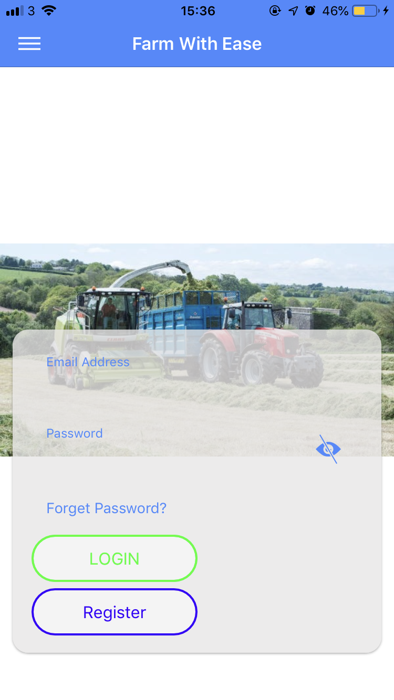 |

[Top](#contents) 

* Register Page

| IOS  |
| :-------------: |
| 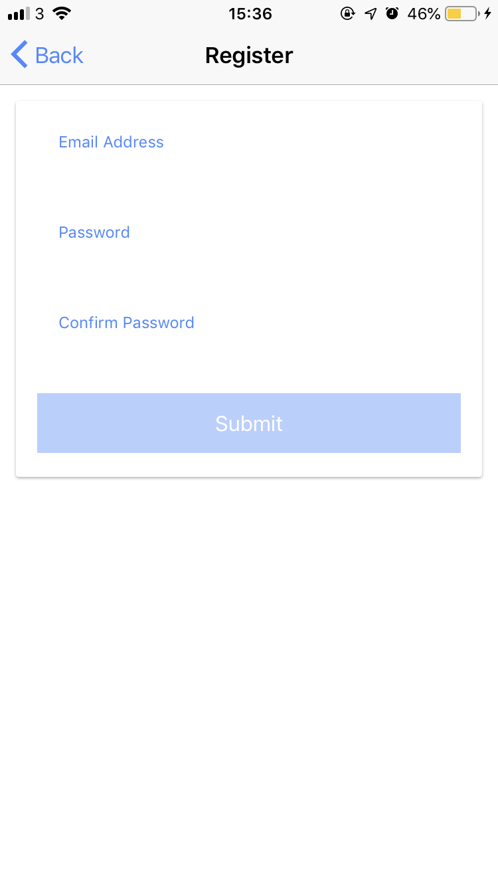 |

[Top](#contents) 

* Reset Password

| IOS  |
| :-------------: |
| 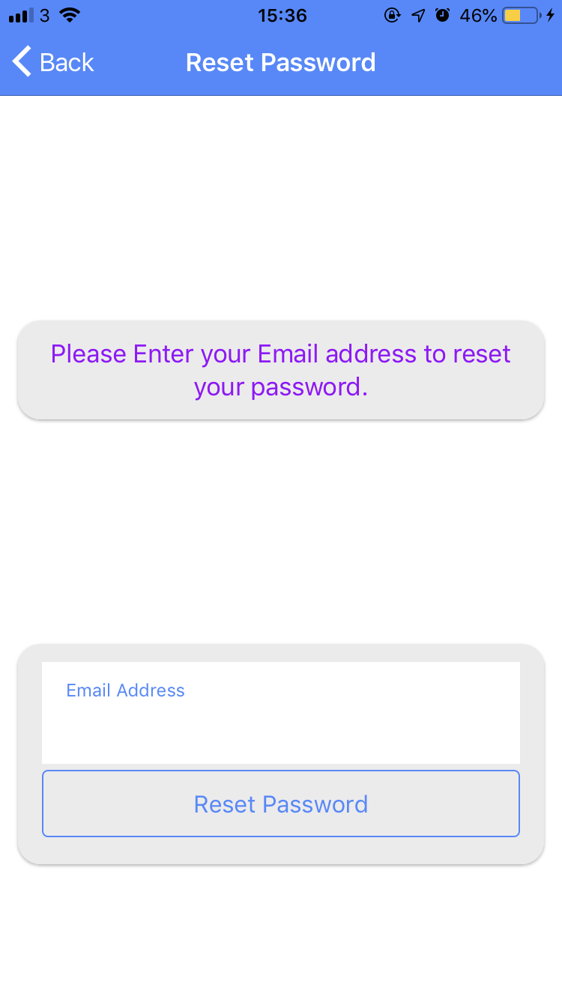 |

[Top](#contents) 

* Side Menu

| IOS  |
| :-------------: |
| 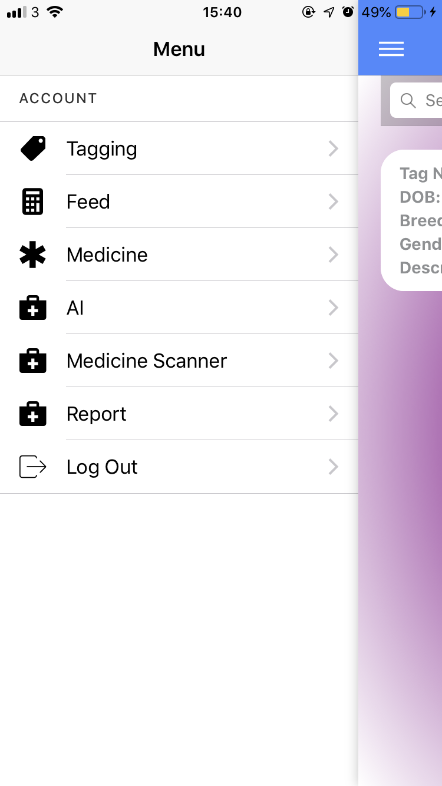 |

[Top](#contents) 

* Scanner

| IOS  |
| :-------------: |
| 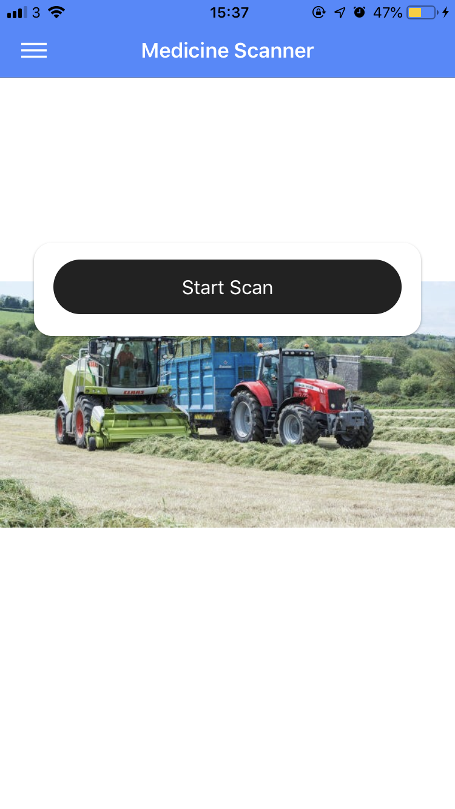 |

[Top](#contents) 

* Report Page

| IOS  |
| :-------------: |
| 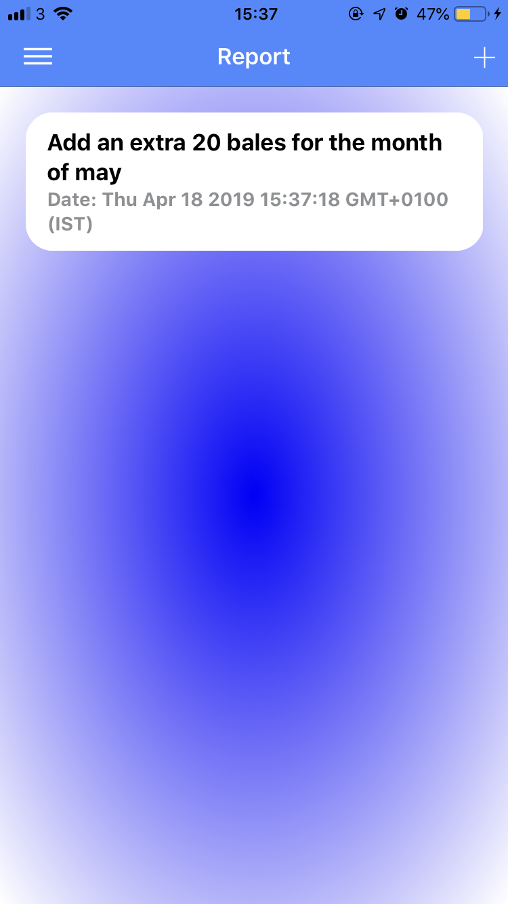 |

[Top](#contents) 

* Add Pages

| IOS  | IOS | IOS |
| :-------------: | :-------------: | :-------------: |
| 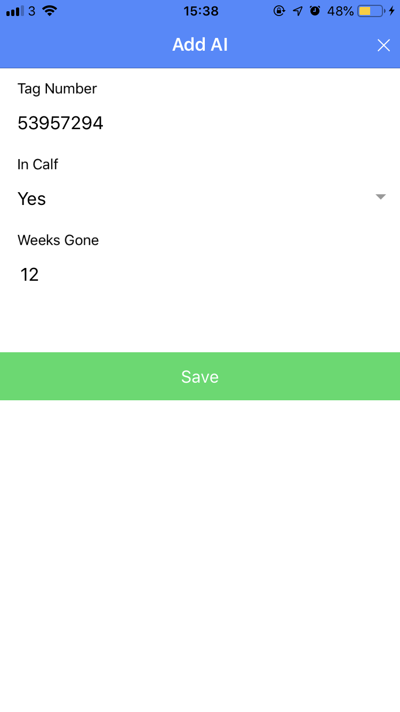 | 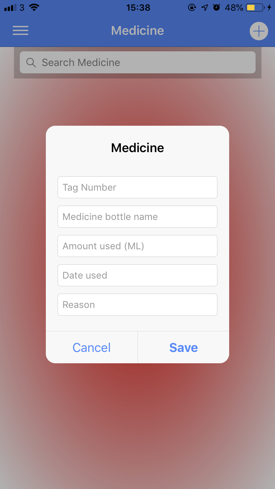 |  |

[Top](#contents) 

* Pages

| IOS  | IOS | IOS |
| :-------------: | :-------------: | :-------------: |
| 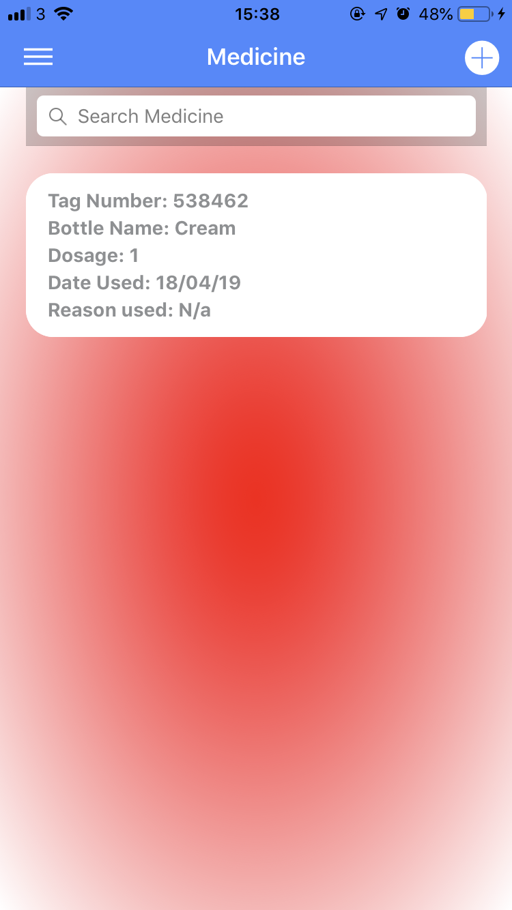 | 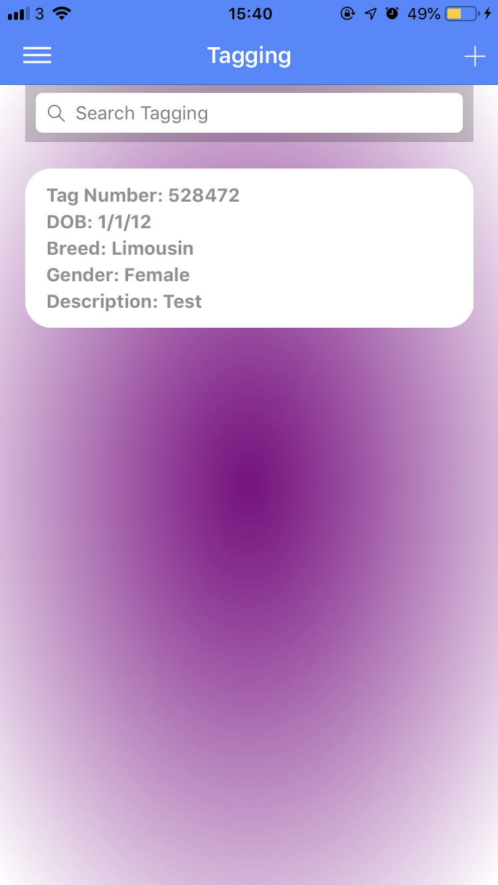 | 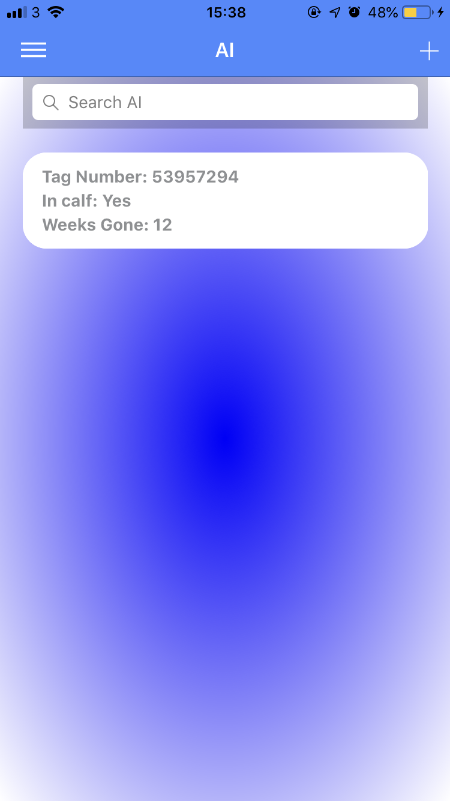 |

[Top](#contents) 

* Feed Page

| IOS  | IOS | IOS | IOS |
| :-------------: | :-------------: | :-------------: | :-------------: |
| 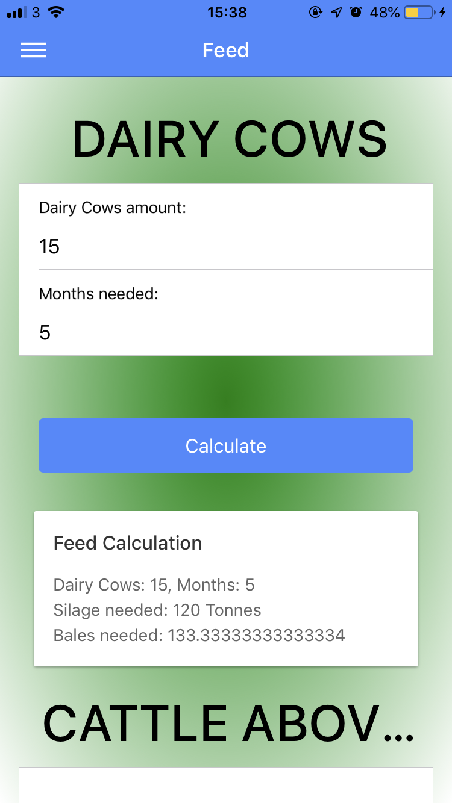 | 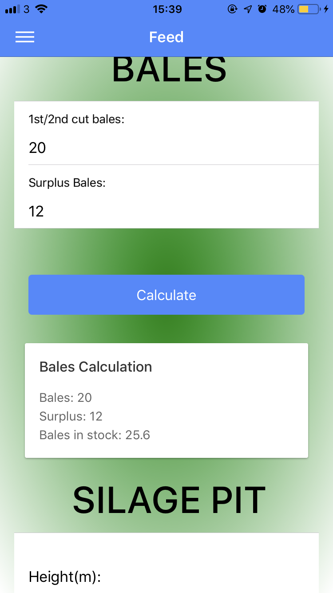 | 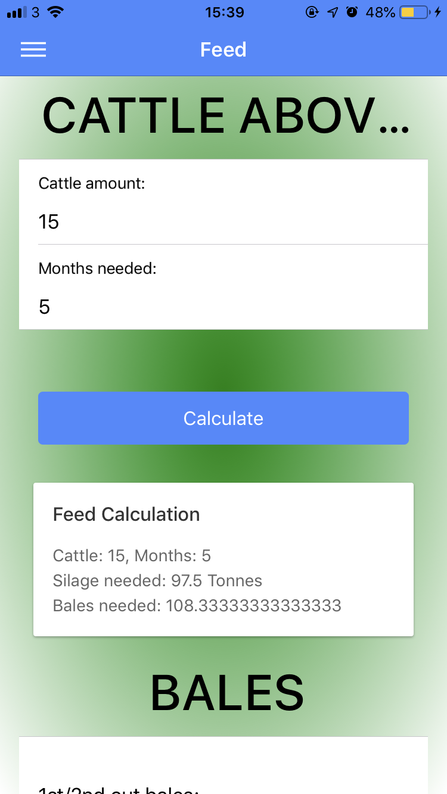 | 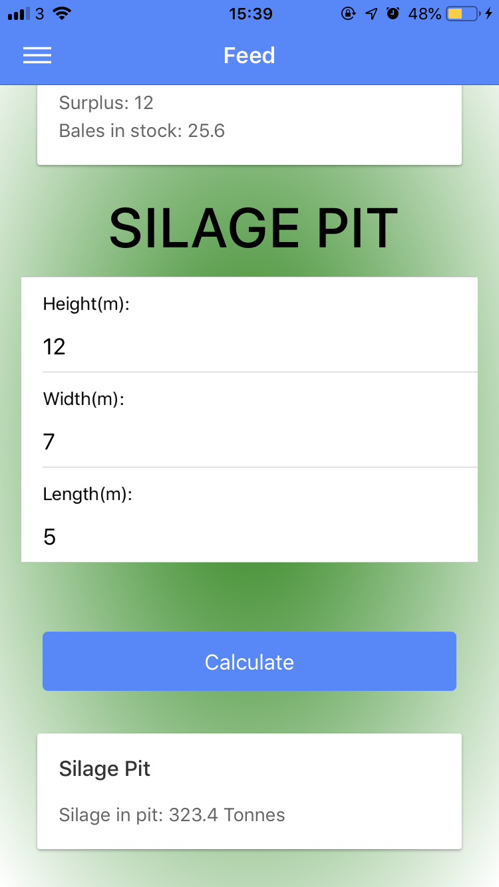 |

[Top](#contents)

# Deployment<a name = "deploy"></a>
### Deploy on Android Device
* This repository contains our [FarmWithEase.apk](https://github.com/Gazza1996/Final-Year-Project-Applied-Diss/blob/master/FarmWithEase/FarmWithEase.apk) file.
* Download this apk and install it on your android device.

### Hosting
* Our app is being hosted online using the firebase hosting service. It can be accessed [here](https://farming-26588.firebaseapp.com/?fbclid=IwAR2r17Ii8gp7nfq41e5yE5JKVo52AhHzU4Iq_odxpmAJrQNhnJIwdG7xDmQ)

## Deploy Locally

Prerequisites
* Mongo Installed - Click [here](https://www.mongodb.com/download-center?jmp=tutorials&_ga=2.180285351.2088142531.1523826631-1629278295.1507240892#community) for instructions.
* NodeJS, Ionic, Cordova - Click [here](https://ionicframework.com/docs/intro/installation/) and follow the instructions.

### Deploy Back-End
1. Clone or Download this repository.
2. Start MongoDB. You should be able to do this by pressing the windows key and searching for the following command then running it. 
```bash
mongo
```
If this fails you can start mongo running by executing the following command from the bin folder of your installation of Mongo.
```bash
mongod
```
3. In your terminal or CMD, navigate to the FarmWithEase back-end folder which in this project is called 'server'. First make sure that mongo is running in its own terminal. Complete the following commands to get the server running.

```bash
npm install
node server.js
```

The back-end should now be running locally on your machine.

### Deploy Front End
1. Clone or Download this repository.
2. In your terminal navigate into the folder.  
3. Run the following command to install the project dependencies.

```bash
npm install
```
4. Once complete run this command to view the application running in development mode.

```bash
ionic serve
```
5. The application should now open up in your browser.

[Top](#contents) 
